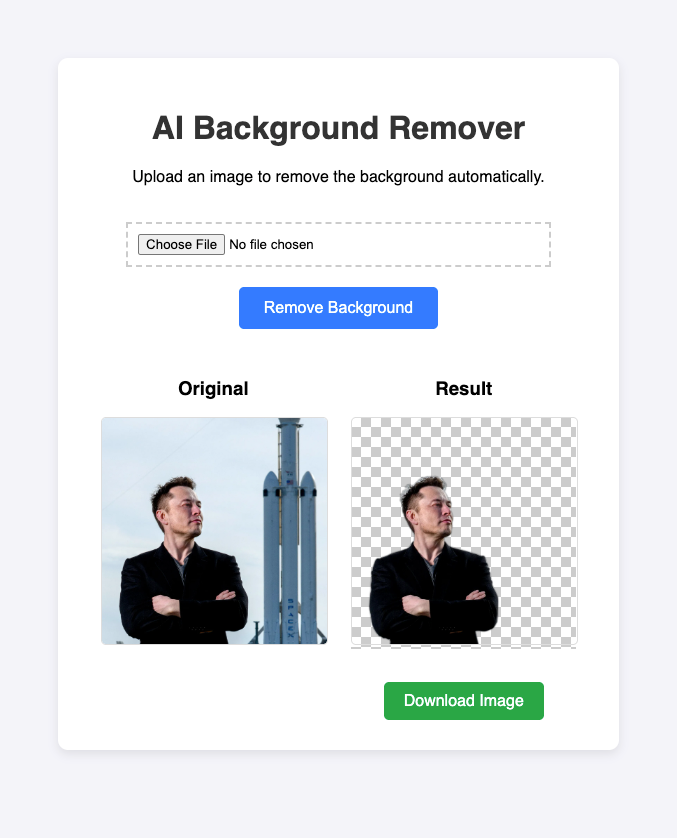

# AI Background Remover

[](https://github.com/mdalmamunit427/background-removal-app-python-yt-short)



A simple and elegant web application that uses AI to automatically remove backgrounds from images. Built with Flask and powered by the `rembg` library, this tool provides an intuitive interface for processing images with transparent backgrounds.

## Features

- 🎨 **AI-Powered Background Removal** - Automatically detects and removes backgrounds using advanced AI models
- 📤 **Easy Upload** - Simple drag-and-drop or file selection interface
- 👀 **Side-by-Side Comparison** - View original and processed images side by side
- 💾 **Download Results** - Download processed images with transparent backgrounds
- ⚡ **Fast Processing** - Quick background removal powered by ONNX runtime
- 🎯 **User-Friendly UI** - Clean, modern interface with loading indicators

## Technologies Used

- **Flask** - Python web framework
- **rembg** - AI-powered background removal library
- **PIL (Pillow)** - Image processing
- **HTML/CSS/JavaScript** - Frontend interface

## Installation

### Prerequisites

- Python 3.8 or higher (python 3.12 recommended)
- pip (Python package manager)

### Setup

1. Clone the repository:
```bash
git clone https://github.com/mdalmamunit427/background-removal-app-python-yt-short.git
cd background-removal-app-python-yt-short
```

2. Create a virtual environment (recommended):
```bash
python -m venv venv
source venv/bin/activate  # On Windows: venv\Scripts\activate
```

3. Install dependencies:
```bash
pip install flask rembg pillow
```

## Usage

1. Start the Flask application:
```bash
python app.py
```

2. Open your web browser and navigate to:
```
http://localhost:5000
```

3. Upload an image using the file input field

4. Click "Remove Background" and wait for processing

5. View the result and download the processed image with transparent background

## Project Structure

```
bg-removal-app/
├── app.py                 # Flask application main file
├── templates/
│   └── index.html         # Frontend template
├── static/
│   └── uploads/           # Uploaded and processed images
├── requirements.txt        # Python dependencies
└── README.md              # Project documentation
```

## How It Works

1. **Upload**: User selects an image file through the web interface
2. **Processing**: The image is processed using the `rembg` library, which uses deep learning models to detect and remove backgrounds
3. **Result**: The processed image with a transparent background is saved and displayed
4. **Download**: Users can download the processed image in PNG format (supports transparency)

## Dependencies

- Flask - Web framework
- rembg - Background removal library
- Pillow (PIL) - Image processing

See `requirements.txt` for the complete list of dependencies.

## Notes

- The first run may take longer as the AI model downloads automatically
- Processed images are saved in the `static/uploads/` directory
- Supported image formats: JPEG, PNG, WEBP, and other formats supported by PIL

## License

This project is open source and available for personal and commercial use.

## Contributing

Contributions, issues, and feature requests are welcome! Feel free to check the [issues page](https://github.com/mdalmamunit427/background-removal-app-python-yt-short/issues).

## Repository

🔗 **GitHub**: [https://github.com/mdalmamunit427/background-removal-app-python-yt-short](https://github.com/mdalmamunit427/background-removal-app-python-yt-short)

---

Made with ❤️ using Flask and AI

# Image-Bg-remover
